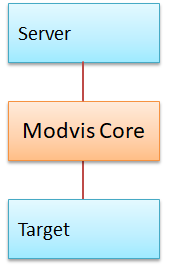

# Modvis Standalone Server
In this project we will show how to use the modvis server core project.  
Use your own server and target implementation.  


To test the example, start the animation server application (AnimationServer.java).

```
String jsonMessage = "{\"bind\":[{\"id\":[]}]}";
receiveMessageFromBrowser(animationWebSocket, jsonMessage);
    
jsonMessage = "{\"elmStartType\":{\"id\":[],\"type\":\"history\"}}";
receiveMessageFromTarget(animationTarget, jsonMessage);
jsonMessage = "{\"elmStartType\":{\"id\":[],\"type\":\"snapshot\"}}";
receiveMessageFromTarget(animationTarget, jsonMessage);
jsonMessage = "{\"elmStartType\":{\"id\":[],\"type\":\"update\"}}";
receiveMessageFromTarget(animationTarget, jsonMessage);
jsonMessage = "{\"elm\":[{\"id\":[2, 1, 1],\"st\":1,\"seq\":0}]}";
receiveMessageFromTarget(animationTarget, jsonMessage);

jsonMessage = "{\"crc\":\"get\", \"modulId\":[]}";
receiveMessageFromBrowser(animationWebSocket, jsonMessage);  
jsonMessage = "{\"crc\":498202763,\"modulId\":[]}";
receiveMessageFromTarget(animationTarget, jsonMessage);
```

## Requirements
Actifsource  Workbench Community Edition

## License
[http://www.actifsource.com/company/license](http://www.actifsource.com/company/license)
